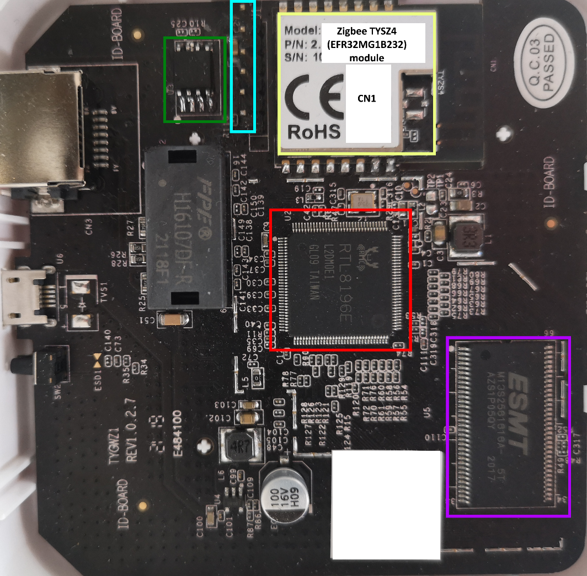

# Lidl / Silvercrest Zigbee Gateway — Hardware Overview

This section provides a detailed breakdown of the Lidl Silvercrest Zigbee
gateway's hardware. It includes component identification, debug interface
pinout, and serial specifications to help you understand and repurpose the
device.

______________________________________________________________________

## 🧱 Physical Construction

- Screwless case held by 8 plastic clips evenly distributed along the edges
- Clips require careful prying to open the lid
- Single PCB housing all components

______________________________________________________________________

## 📸 Main PCB Overview

<p align="center">
  
</p>

______________________________________________________________________

## 🔩 Main Components

### 1. Main Processor (U2) — _Red Box_

- **SoC**:
  [Realtek RTL8196E](https://www.alldatasheet.com/datasheet-pdf/pdf/1315416/REALTEK/RTL8196E-CG.html)
- 32-bit Lexra RLX4181 core (MIPS32-compatible, big-endian)
- Lacks unaligned memory access; uses MIPS16e compressed instructions
- Runs at 400 MHz
- Embedded Ethernet switch with 3 logical interfaces: `eth0`, `eth1`, and
  `peth0` (virtual)
- Serial: two 16550A-compatible UARTs at MMIO addresses `0x18002000` and
  `0x18002100`
- SPI controller used to access external NOR flash

### 2. Flash Memory (U3) — _Green Box_

- 16MB SPI NOR Flash
  ([GD25Q127](https://www.alldatasheet.com/datasheet-pdf/pdf/1151509/GIGADEVICE/GD25Q127C.html))
- 64KB erase blocks
- Stores bootloader, Linux kernel, SquashFS rootfs, and JFFS2 persistent
  data

### 3. RAM (U5) — _Purple Box_

- 32MB SDRAM
  ([ESMT M13S2561616A](https://www.alldatasheet.com/datasheet-pdf/pdf/302727/ESMT/M13S2561616A.html))
  or equivalent

### 4. Zigbee Module (CN1) — _Yellow Box_

- [Tuya TYZS4](https://developer.tuya.com/en/docs/iot/zigbeetyzs4module?id=K989rhycrz23f)
- Based on Silicon Labs
  [EFR32MG1B232F256GM48](https://www.silabs.com/wireless/zigbee/efr32mg1-series-1-socs/device.efr32mg1b232f256gm48)
- ARM Cortex-M4 core with integrated Zigbee stack
- Connected to RTL8196E via UART1
- Hosts the Zigbee firmware (typically NCP/UART)

### 5. Debug/Programming Interface (J1) — _Cyan Box_

- Combined serial + SWD debug port
- Not populated by default (2.54mm header needed)
- Pinout:
  ```
  Pin 1: 3.3V VCC (bottom)
  Pin 2: Ground
  Pin 3: U2 Serial TX
  Pin 4: U2 Serial RX
  Pin 5: Zigbee module SWDIO
  Pin 6: Zigbee module SWCLK
  ```

______________________________________________________________________

## 🔌 Serial Port Specifications

- Logic level: TTL 3.3V
- Baud rate: 38400 bps
- Configuration: 8 data bits, no parity, 1 stop bit (8N1)

______________________________________________________________________

## 🧩 Additional Components

- Ethernet magnetics
- Status LEDs:
  - Ethernet activity
  - Zigbee communication
- Clearly labeled test points on PCB (Side B)
- Supporting discrete components (caps, resistors, etc.)

______________________________________________________________________

## 🧠 Design Summary

- Clean, well-structured single-board design
- Minimalist layout with clearly separated domains (SoC / Zigbee)
- Accessible debug interface and test points for hardware hacking
- Suitable for firmware customization and hardware-based reverse
  engineering
