# Simplicity Studio V5


## Silicon Labs Tools Overview

Silicon Labs provides several tools for EFR32 development. See the [full list](https://www.silabs.com/software-and-tools/simplicity-studio/developer-tools).

| Tool | Description |
|------|-------------|
| **Simplicity Studio** | Full IDE with GUI for project creation, configuration, and flashing |
| **slc** | Command-line tool to create and configure projects |
| **Commander** | Flash, debug, and secure devices via GUI or CLI |
| **Network Analyzer** | Capture and analyze wireless network traffic |

**Simplicity Studio V5** is Silicon Labs' official IDE for developing and flashing firmware onto EFR32MG1B chips. It is an alternative to the CLI-based approach used in this project (see [24-NCP-UART-HW](../24-NCP-UART-HW/), [25-RCP-UART-HW](../25-RCP-UART-HW/), etc.) which uses `slc`.

**Note:** The EFR32MG1B is a Series 1 chip. Simplicity Studio V5 is the latest Silabs IDE supporting Series 1. The newer Simplicity Studio V6 only supports Series 2 chips.

## Download

Download from the official Silicon Labs website:

https://www.silabs.com/software-and-tools/simplicity-studio/simplicity-studio-version-5

A free Silicon Labs account may be required later to download SDKs.


## Notes

- **Debugger (J-Link, etc.)**: Required to flash firmware via SWD. See
  [22-Backup-Flash-Restore](../22-Backup-Flash-Restore/) for hardware setup.
- **Administrator Privileges**: On some Linux systems, you may need to run
  Simplicity Studio as root.
  ```sh
  sudo ./studio.sh
  ```
- **udev Rules for Debugger Access**: If your debugger is not recognized,
  create a udev rule:
  ```sh
  echo 'SUBSYSTEM=="usb", ATTR{idVendor}=="1366", MODE="0666"' | sudo tee /etc/udev/rules.d/99-segger.rules
  sudo udevadm control --reload-rules
  ```
- **Java Dependencies**: If Simplicity Studio fails to start, ensure you
  have Java installed:
  ```sh
  sudo apt install default-jre
  ```

______________________________________________________________________

## Example 1: Building the Bootloader (UART XMODEM)

### Step 1: Load the Gecko bootloader-uart-xmodem demo file

The Gecko `bootloader-uart-xmodem` firmware is available by default as an example
application for the `EFR32MG1B232F256GM48` chip.

1. In the **Launcher** tab, add the `EFR32MG1B232F256GM48` part to the **My
   Products** list, then click **Start**.

2. In the **Example Projects and Demos** tab, search for `bootloader`,
   choose the `Bootloader - NCP UART XMODEM` project and enter `CREATE`
   <p align="center">
     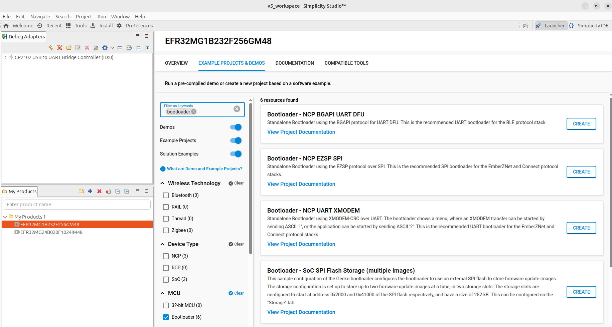
   </p>

3. Accept default options and click **Finish**. Wait until the C/C++
   indexation is complete.

<p align="center">
     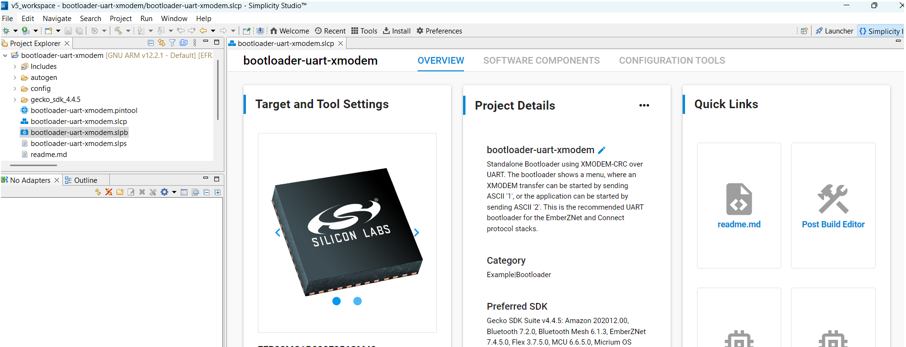
   </p>

### Step 2: Pin Assignment

1. In the **Configuration Tools** panel, open the **Pin Tool**.

2. Assign `PA0`, `PA1`, `PB13` respectively to `USART0_TX`, `USART0_RX` and `DBG_SWV` as shown below:

   <p align="center">
     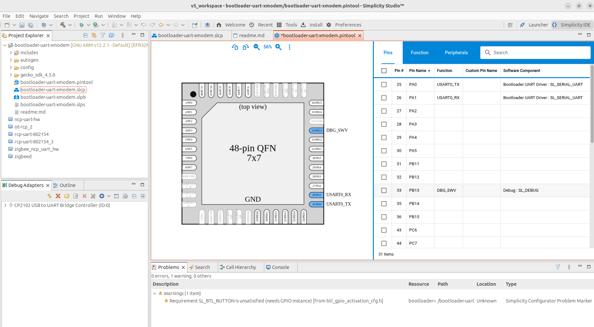
   </p>

3. Exit the **Pin Tab** and save.

### Step 3: Fix Pre-compilation Warning

We want to get rid of the SL_BTL_BUTTON warning:

1. Go back to the **Project Main Panel** and open the **Software
   Components** tab.

2. Set the filter to `Installed`.

3. Search for `GPIO`.

   <p align="center">
     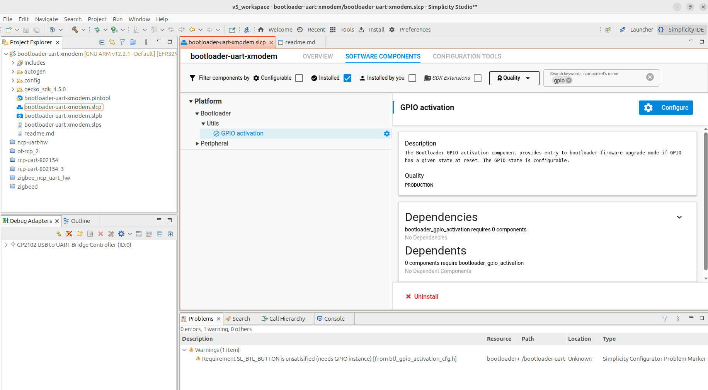
   </p>

4. Uninstall the GPIO activation component

At this stage, the initial pre-compilation warning should have disappeared.

### Step 4: Build the firmware

Right-click on the project name (`bootloader-uart-xmodem`) in the
left-panel and click on `Build Project`. The compilation should run without
any errors. The generated files are located in the
`GNU ARM v12.2.1/` directory ready to be flashed with `commander`.

   <p align="center">
     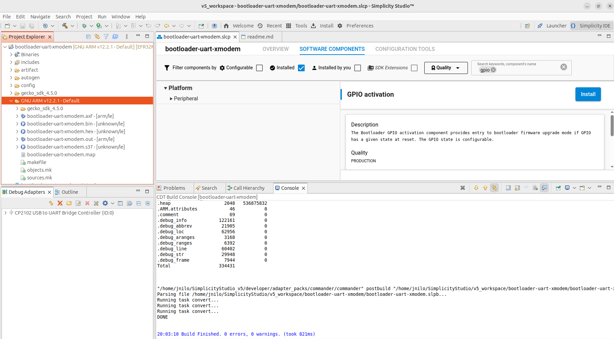
   </p>
______________________________________________________________________

## Example 2: Building NCP-UART-HW

### Step 1: Create an NCP-UART-HW Demo File

The `NCP-UART-HW` firmware is not available by default as an example
application for the `EFR32MG1B232F256GM48` chip. Therefore, we need to load
it from another chip.

1. In the **Launcher** tab, add the `EFR32MG12P432F1024GL125` part to the
   **My Products** list, then click **Start**.

   <p align="center">
     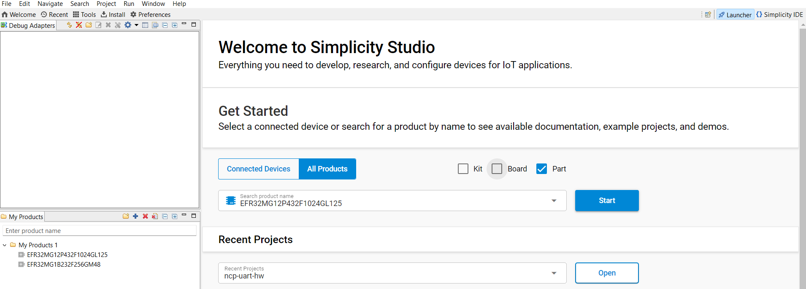
   </p>

2. In the **Example Projects and Demos** tab, search for `NCP-UART-HW` and
   choose the `Zigbee – NCP ncp-uart-hw` project. Enter `CREATE`

   <p align="center">
     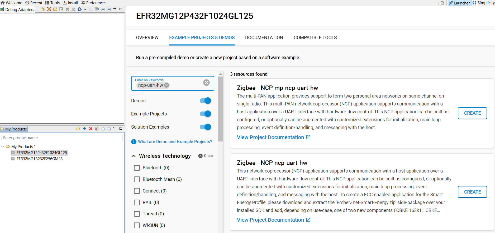
   </p>

3. Accept default options and click **Finish**. Wait until the C/C++
   indexation is complete.

4. In the **Overview** panel, go to **Target and Tools settings** and at
   the bottom, click **Change Target/SDK/Generators**. Change the **Part
   reference** to `EFR32MG1B232F256GM48` and save.

   <p align="center">
     
   </p>
   <p align="center">
     
   </p>

### Step 2: Pin Assignment

1. In the **Configuration Tools** panel, open the **Pin Tool**.

2. Assign `PA0`, `PA1`, `PA4`, and `PA5` respectively to USART0_TX,
   USART0_RX, USART0_RTS and USART0_CTS as shown below:

   <p align="center">
     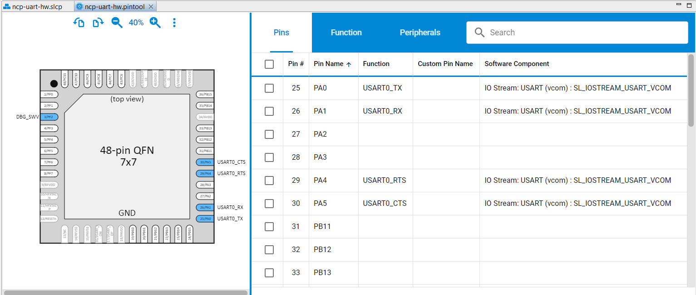
   </p>

3. Exit the **Pin Tab** and save.

### Step 3: Fix Pre-compilation Warnings

We want to get rid of the following pre-compilation warnings:

<p align="center">
     
   </p>

1. Go back to the **Project Main Panel** and open the **Software
   Components** tab.

2. Set the filter to `Installed`.

3. Search for `vcom`.

   <p align="center">
     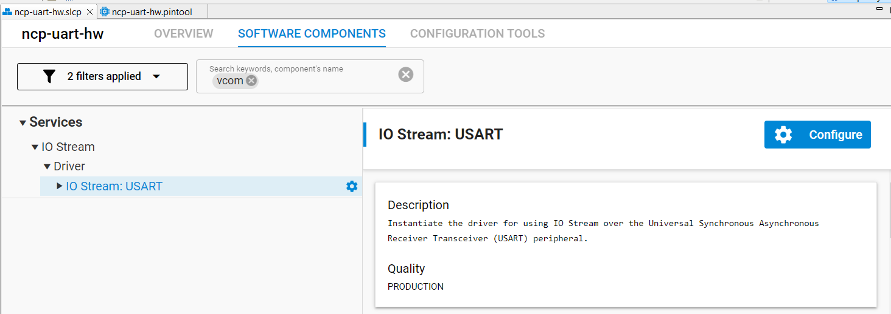
   </p>

4. Open the component editor for `IO Stream USART` and assign `USART0` to
   `SL_IOSTREAM_USART_VCOM`.

   <p align="center">
     
   </p>

5. Search for `PTI`.

   <p align="center">
     
   </p>

6. Open the component editor for `RAIL Utility, PTI` and assign `PB12` to
   `DOUT`.

   <p align="center">
     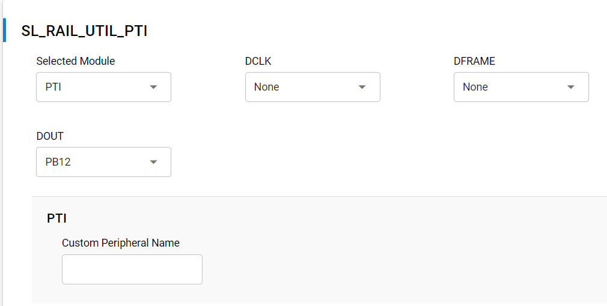
   </p>

At this stage, the initial pre-compilation warnings should have disappeared.

### Step 4: Optimize for EFR32MG1B 256K Memory

If you try to compile the firmware at this stage, you will receive an error
stating that the output exceeds the available memory.

<p align="center">
     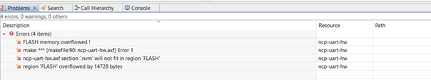
   </p>

To fit within the `256K` memory of the `EFR32MG1B`, remove unnecessary
debug or non-critical functions:

1. Open the **Software Components** tab.
2. Search for and uninstall the following components:
   - Debug Print
   - Debug Extended
   - Zigbee Light Link
   - IO Stream VUART

Ensure that the `*.c` indexation is completed before uninstalling the next component.

### Step 5: Delay the EFR32MG1B Boot Process

The boot process must be delayed to allow the `RTL8196E` bootloader to
complete its initialization.

1. In the **Software Components** tab, search for `Microsecond Delay`.

2. Install the `Microsecond Delay` function.

   <p align="center">
     
   </p>

3. Edit the `main.c` file and add:

   ```c
   #include "sl_udelay.h"
   ```

4. At the beginning of `int main(void)`, insert:

   ```c
   // Add 1sec delay before any reset operation to accommodate RTL8196E boot
   sl_udelay_wait(1000000);     // 1s delay
   ```

   The `main.c` file should now look like:

   <p align="center">
     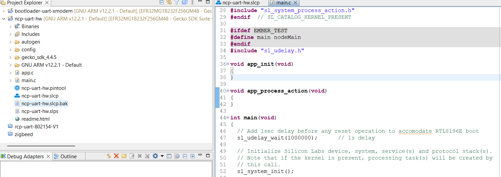
   </p>

### Step 6: Define post-build command to create gbl file

The `ncp-uart-hw.gbl` file is not created by default. Right-click on the project name and go to
`Properties → C/C++ Build → Settings → Build Steps` and enter:

```
commander gbl create ncp-uart-hw.gbl --app ncp-uart-hw.s37
```

<p align="center">
     
   </p>

### Step 7: Build the firmware

Right-click on the project name (`ncp-uart-hw`) in the left-panel and click
on `Build Project`. The compilation should run without any errors. The
generated file `ncp-uart-hw.gbl` is located in the build directory ready to be flashed.

______________________________________________________________________

