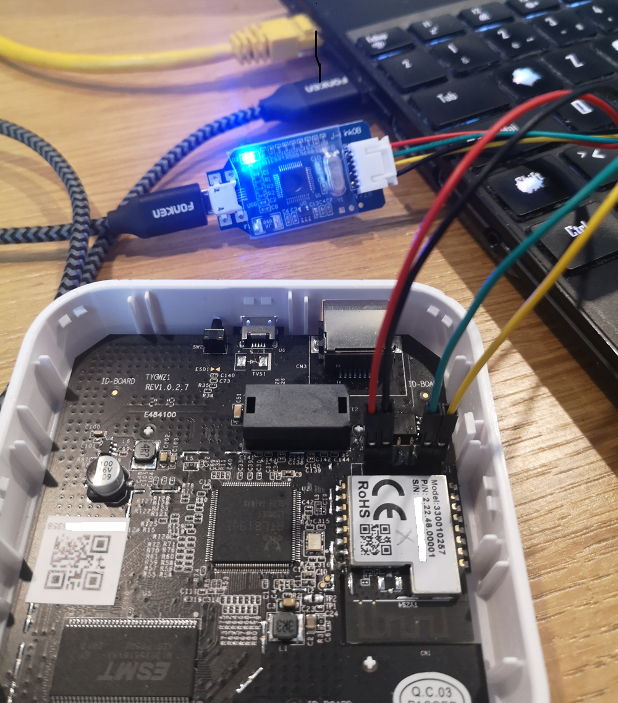

# Backup, Flash and Restore Procedure

## Overview

This guide covers the **EFR32MG1B Zigbee radio chip** firmware, not the
main Linux system running on the RTL8196E SoC. The Lidl Silvercrest gateway
contains two separate processors:

- **RTL8196E** (main SoC): Runs Linux and hosts `serialgateway`
- **EFR32MG1B232F256GM48** (Zigbee radio): Runs the EmberZNet/EZSP firmware covered here

Before modifying the Zigbee radio firmware, it is **strongly recommended**
to back up the original firmware. This ensures you can recover in case of
a failed update or configuration error.

This guide describes two main methods to back up, flash and restore the
**EFR32MG1B Zigbee firmware**:

1. **Method 1 – Hardware-based (Full Backup/Restore)**:\
   Using a hardware debugger via the SWD interface with Simplicity
   Commander. Required for full flash backup (`.bin`) and restore.

2. **Method 2 – Software-based (Firmware Update Only)**:\
   Using `universal-silabs-flasher` via `serialgateway` over TCP.
   Convenient for updating firmware (`.gbl` files) without extra hardware.

> ℹ️ **Which method to choose?**
> - Use **Method 1** for full backup/restore or if you need to recover a
>   bricked device.
> - Use **Method 2** for routine firmware updates when the Gecko Bootloader
>   is functional.

______________________________________________________________________

### Firmware File Types: `.bin`, `.s37`, and `.gbl`

When working with EFR32MG1B firmware, you may encounter different file
formats, each serving specific purposes:

- **`.bin` (Raw Binary)**: A direct dump of the flash memory. This format
  is typically produced by the `commander readmem` command or
  `universal-silabs-flasher`. It contains the exact contents of the flash,
  byte-for-byte, without metadata. It is the **preferred format for full
  backup and restore operations** using hardware debuggers or low-level
  tools.

- **`.s37` (Motorola S-Record)**: An ASCII-based, human-readable
  representation of binary data, often used during development or with
  bootloaders. While supported by many Silicon Labs tools, this format is
  less common in user-generated backups.

- **`.gbl` (Gecko Bootloader Image)**: A structured, compressed firmware
  package used for **bootloader-based OTA (Over-The-Air)** or UART-based
  updates. It includes integrity checks and metadata, making it suitable
  for secure, partial updates, but **cannot be used for full flash
  restoration**. `commander flash` accepts `.gbl` files, but only if the
  bootloader is intact and supports it.

> ⚠️ **Important**: When performing a full firmware backup or raw
> restoration, always use the `.bin` format. Flashing `.gbl` files over raw
> flash interfaces (like SWD) will not reconstruct the original flash
> layout and may result in a non-functional system unless the Gecko
> Bootloader is in place and operational.

______________________________________________________________________

## Method 1: Hardware Backup, Flash & Restore via SWD (Recommended)

### Requirements

- Lidl Silvercrest gateway with accessible SWD pins
- A J-Link or compatible SWD debugger. I personally use a cheap (less than
  5 USD incl shipping) OB-ARM Emulator Debugger Programmer:
  <p align="center">  </p>

A useful investment! You can also build your own debugger with a Raspberry
Pico and [`OpenOCD`](https://openocd.org/). Search the web!

- [Simplicity Studio V5](https://www.silabs.com/developers/simplicity-studio)
  with `commander` tool
- Dupont jumper wires (x4)

### Pinout and Wiring

Connect the debugger to the gateway as follows:

| Gateway Pin | Function    | J-Link Pin |
| ----------- | ----------- | ---------- |
| 1           | VREF (3.3V) | VTref      |
| 2           | GND         | GND        |
| 5           | SWDIO       | SWDIO      |
| 6           | SWCLK       | SWCLK      |

______________________________________________________________________

### Backup Procedure

1. **Launch Commander**:\
   On Windows (default path):

   ```bash
   cd "C:\SiliconLabs\SimplicityStudio\v5\developer\adapter_packs\commander"
   ```

2. **Check Device Connection**:

   ```bash
   commander device info --device EFR32MG
   ```

   Output:

   ```
   C:\SiliconLabs\SimplicityStudio\v5\developer\adapter_packs\commander>commander device info --device EFR32MG
   Reconfiguring debug connection with detected device part number: EFR32MG1B232F256GM48
   Part Number    : EFR32MG1B232F256GM48
   Die Revision   : A3
   Production Ver : 166
   Flash Size     : 256 kB
   SRAM Size      : 32 kB
   Unique ID      : xxxxxxxxxxxxxxxx
   User Data Page : Unlocked
   Mass Erase     : Unlocked
   Bootloader     : Enabled
   Pin Reset      : Soft Reset
   DONE
   ```

3. **Read Full Flash (256KB)**:

   ```bash
   commander readmem --device EFR32MG1B232F256GM48 --range 0x0:0x40000 --outfile original_firmware.bin
   ```

   Output:

   ```
   C:\SiliconLabs\SimplicityStudio\v5\developer\adapter_packs\commander>commander readmem --device EFR32MG1B232F256GM48 --range 0x0:0x40000 --outfile original_firmware.bin
   Reading 262144 bytes from 0x00000000...
   Writing to original_firmware.bin...
   DONE
   ```

   This creates a full backup of the firmware, including the bootloader.

4. **(Optional) Verify Backup**:

   ```bash
   commander verify --device EFR32MG1B232F256GM48 original_firmware.bin
   ```

   Output:

   ```
   C:\SiliconLabs\SimplicityStudio\v5\developer\adapter_packs\commander>commander verify --device EFR32MG1B232F256GM48 original_firmware.bin
   Parsing file original_firmware.bin...
   Verifying 262144 bytes at address 0x00000000...OK!
   DONE
   ```

______________________________________________________________________

### Restore Procedure

1. **Connect and verify debugger** as above.

2. **Flash firmware**:

   ```bash
   commander flash --device EFR32MG1B232F256GM48 firmware.bin
   ```

   Output:

   ```
   C:\SiliconLabs\SimplicityStudio\v5\developer\adapter_packs\commander>commander flash --device EFR32MG1B232F256GM48 firmware.bin
   Parsing file firmware.bin...
   Writing 262144 bytes starting at address 0x00000000
   Comparing range 0x00000000 - 0x0001FFFF (128 KB)
   Comparing range 0x00020000 - 0x0003FFFF (128 KB)
   Comparing range 0x00000000 - 0x00003FFF (16 KB)
   Comparing range 0x00038000 - 0x0003FFFF (32 KB)
   Erasing range 0x00004000 - 0x00023FFF (64 sectors, 128 KB)
   Erasing range 0x00024000 - 0x00037FFF (40 sectors, 80 KB)
   Programming range 0x00004000 - 0x00004FFF (4 KB)
   Programming range 0x00005000 - 0x00005FFF (4 KB)
   Programming range 0x00006000 - 0x00006FFF (4 KB)
   # ... more output
   Programming range 0x00035000 - 0x00035FFF (4 KB)
   Programming range 0x00036000 - 0x00036FFF (4 KB)
   Programming range 0x00037000 - 0x00037FFF (4 KB)
   Flashing completed successfully!
   DONE
   ```

Alternatively, use Simplicity Studio GUI:

- Launch Simplicity Studio
- Open Tools → Commander
- Use the **Flash** tab to select your `.bin` file and program it

______________________________________________________________________

### Flashing a `.gbl` File (Bootloader Mode Only)

If your device is running a functional Gecko Bootloader, you can flash
`.gbl` (Gecko Bootloader Image) files using Commander or the Simplicity
Studio GUI. This method is useful for incremental updates or OTA-style
deployment but **cannot perform full firmware restoration**.

#### Using Commander:

```bash
commander gbl flash --device EFR32MG1B232F256GM48 firmware.gbl
```

#### Caveats:

- The Gecko Bootloader **must be present and working**. If the bootloader
  is erased or corrupted, this method will fail silently.
- Flashing a `.gbl` file does **not overwrite the full flash memory**.
  Configuration, bootloader, and custom sections may be left unchanged.
- Do **not** use `.gbl` files if your goal is a full recovery or to revert
  to the factory state. Use `.bin` instead.

Alternatively, you can flash a `.gbl` file via the Simplicity Studio GUI:

- Open Simplicity Studio → Tools → Commander
- Select the **Upgrade Application** tab
- Choose your `.gbl` file and click Flash

______________________________________________________________________

## Method 2: Software-Based Flash & Restore (Without Hardware)

This method uses `serialgateway` running on the Lidl gateway to expose the
EFR32 serial port over TCP, allowing remote firmware updates via the Gecko
Bootloader.

> ℹ️ **Note:** This method only supports flashing `.gbl` files (not raw
> `.bin` backups). For full flash backup/restore, use Method 1 (SWD).

**Common prerequisites for all software methods:**

- `serialgateway` running on the gateway with **`-f` flag** (no HW flow control)
- No Zigbee2mqtt or ZHA attached to your gateway
- No other SSH or terminal session connected to the gateway
- A robust Ethernet **wired** connection (no Wi-Fi!)

### Using universal-silabs-flasher

[universal-silabs-flasher](https://github.com/NabuCasa/universal-silabs-flasher)
is a Python tool developed by NabuCasa that reliably flashes Silicon Labs
Zigbee/Thread devices via the Gecko Bootloader.

#### Prerequisites

1. **serialgateway must be started with `-f` flag** (disable hardware flow
   control). This is **critical** - flashing will fail without it:

   ```bash
   # On the Lidl gateway via SSH
   killall serialgateway
   serialgateway -f &
   ```

   You should see:
   ```
   serialgateway 2.0: port 8888, serial=/dev/ttyS1, baud=115200, flow=sw
   ```

   > ⚠️ **Important:** The Gecko Bootloader does not use hardware flow
   > control. If serialgateway runs with hardware flow control enabled
   > (default), the bootloader will not respond after the EZSP firmware
   > triggers the reboot, causing `FailedToEnterBootloaderError`.

2. **No other process using the serial port** (Zigbee2mqtt, ZHA, etc.)

3. **Wired Ethernet connection** (no Wi-Fi)

#### Installation

On your Linux machine, create a virtual environment and install the tool:

```bash
python3 -m venv silabs-flasher
source silabs-flasher/bin/activate
pip install universal-silabs-flasher
```

#### Usage

**Probe the device** (check connectivity and current firmware):

```bash
universal-silabs-flasher --device socket://GATEWAY_IP:8888 probe
```

Example output (probe of the original Lidl gateway EZSP 6.5.0.0 firmware):
```
(silabs-flasher) jnilo@jnilo-Key-R:~/silabs-flasher$ universal-silabs-flasher --device socket://192.168.1.126:8888 probe
2025-12-18 10:52:53.375 jnilo-Key-R universal_silabs_flasher.flasher INFO Probing ApplicationType.GECKO_BOOTLOADER at 115200 baud
2025-12-18 10:52:55.380 jnilo-Key-R universal_silabs_flasher.flasher INFO Probing ApplicationType.EZSP at 115200 baud
2025-12-18 10:52:57.520 jnilo-Key-R universal_silabs_flasher.flasher INFO Detected ApplicationType.EZSP, version '6.5.0.0 build 188' (6.5.0.0.188) at 115200 baudrate (bootloader baudrate None)
2025-12-18 10:52:57.520 jnilo-Key-R universal_silabs_flasher.flash INFO Dumping EmberZNet Config
CONFIG_PACKET_BUFFER_COUNT=250
CONFIG_NEIGHBOR_TABLE_SIZE=26
CONFIG_APS_UNICAST_MESSAGE_COUNT=100
CONFIG_BINDING_TABLE_SIZE=32
CONFIG_ADDRESS_TABLE_SIZE=8
CONFIG_MULTICAST_TABLE_SIZE=8
CONFIG_ROUTE_TABLE_SIZE=16
CONFIG_DISCOVERY_TABLE_SIZE=8
CONFIG_STACK_PROFILE=0
CONFIG_SECURITY_LEVEL=5
CONFIG_MAX_HOPS=30
CONFIG_MAX_END_DEVICE_CHILDREN=32
CONFIG_INDIRECT_TRANSMISSION_TIMEOUT=3000
CONFIG_END_DEVICE_POLL_TIMEOUT=8
CONFIG_TX_POWER_MODE=0
CONFIG_DISABLE_RELAY=0
CONFIG_TRUST_CENTER_ADDRESS_CACHE_SIZE=0
CONFIG_SOURCE_ROUTE_TABLE_SIZE=200
CONFIG_FRAGMENT_WINDOW_SIZE=1
CONFIG_FRAGMENT_DELAY_MS=0
CONFIG_KEY_TABLE_SIZE=12
CONFIG_APS_ACK_TIMEOUT=1600
CONFIG_ACTIVE_SCAN_DURATION=3
CONFIG_END_DEVICE_BIND_TIMEOUT=60
CONFIG_PAN_ID_CONFLICT_REPORT_THRESHOLD=2
CONFIG_REQUEST_KEY_TIMEOUT=0
CONFIG_CERTIFICATE_TABLE_SIZE=0
CONFIG_APPLICATION_ZDO_FLAGS=0
CONFIG_BROADCAST_TABLE_SIZE=200
CONFIG_MAC_FILTER_TABLE_SIZE=0
CONFIG_SUPPORTED_NETWORKS=1
CONFIG_SEND_MULTICASTS_TO_SLEEPY_ADDRESS=0
CONFIG_ZLL_GROUP_ADDRESSES=1
CONFIG_ZLL_RSSI_THRESHOLD=128
CONFIG_MTORR_FLOW_CONTROL=1
CONFIG_RETRY_QUEUE_SIZE=16
CONFIG_NEW_BROADCAST_ENTRY_THRESHOLD=194
CONFIG_TRANSIENT_KEY_TIMEOUT_S=300
CONFIG_BROADCAST_MIN_ACKS_NEEDED=255
CONFIG_TC_REJOINS_USING_WELL_KNOWN_KEY_TIMEOUT_S=300

```

**Flash a new firmware** (`.gbl` file):

```bash
universal-silabs-flasher --device socket://GATEWAY_IP:8888 flash --firmware firmware.gbl
```

Replace `GATEWAY_IP` with your gateway's IP address (e.g., `192.168.1.126`).

Example output (flash of the original Lidl gateway EZSP 6.5.0.0 firmware):
```
(silabs-flasher) jnilo@jnilo-Key-R:~/silabs-flasher$ universal-silabs-flasher --device socket://192.168.1.126:8888 flash --firmware ncp-uart-hw-7.5.1.gbl
2025-12-18 10:55:11.300 jnilo-Key-R universal_silabs_flasher.flash INFO Failed to read firmware metadata: {exc!r}
2025-12-18 10:55:11.300 jnilo-Key-R universal_silabs_flasher.flasher INFO Probing ApplicationType.GECKO_BOOTLOADER at 115200 baud
2025-12-18 10:55:13.305 jnilo-Key-R universal_silabs_flasher.flasher INFO Probing ApplicationType.EZSP at 115200 baud
2025-12-18 10:55:15.443 jnilo-Key-R universal_silabs_flasher.flasher INFO Detected ApplicationType.EZSP, version '6.5.0.0 build 188' (6.5.0.0.188) at 115200 baudrate (bootloader baudrate None)
ncp-uart-hw-7.5.1.gbl  [####################################]  100%          
(silabs-flasher) jnilo@jnilo-Key-R:~/silabs-flasher$ 
```

#### Post-Flash: Restore Normal Operation

After flashing, restart `serialgateway` **without the `-f` flag** (or simply
reboot the gateway) to restore hardware flow control for normal EZSP
communication.

> ⚠️ **Important:** The EZSP firmware uses hardware flow control for
> reliable communication with Zigbee2mqtt/ZHA. Leaving `-f` enabled may
> cause communication issues during normal operation.

#### Troubleshooting

| Error | Cause | Solution |
|-------|-------|----------|
| `FailedToEnterBootloaderError` | Hardware flow control enabled | Restart serialgateway with `-f` |
| `Failed to probe running application type` | Device not responding | Reset the gateway and retry |
| Connection timeouts | Network issues | Use wired Ethernet, check IP |

______________________________________________________________________

## Resources

- [Simplicity Commander Reference Guide (PDF)](https://www.silabs.com/documents/public/user-guides/ug162-simplicity-commander-reference-guide.pdf)
- [universal-silabs-flasher GitHub](https://github.com/NabuCasa/universal-silabs-flasher)
- [EFR32MG1B Series Datasheet](https://www.silabs.com/documents/public/data-sheets/efr32mg1-datasheet.pdf)
