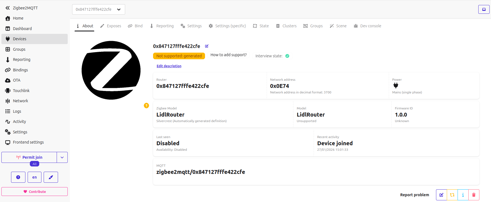

# Zigbee 3.0 Router Firmware for Lidl Silvercrest Gateway

Minimal Zigbee 3.0 Router (SoC) firmware for the EFR32MG1B232F256GM48 chip found in the Lidl Silvercrest Smart Home Gateway.

This firmware transforms the gateway into an autonomous Zigbee router that extends your mesh network coverage.

## Features

- **Zigbee 3.0 Router** - Full mesh routing capabilities
- **Auto-join** - Automatically joins open Zigbee networks via network steering
- **Child support** - Up to 16 sleepy end-devices as children
- **Source routing** - 50-entry route table for large networks
- **Minimal footprint** - ~185KB flash (35KB margin on 256KB chip)
- **NVM3 storage** - 36KB for network credentials and tokens
- **Mini-CLI** - Bootloader access via `universal-silabs-flasher` (reflash support)

## Hardware

| Component | Specification |
|-----------|---------------|
| Zigbee SoC | EFR32MG1B232F256GM48 |
| Flash | 256KB |
| RAM | 32KB |
| Radio | 2.4GHz IEEE 802.15.4 |
| UART | PA0 (TX), PA1 (RX), PA4 (RTS), PA5 (CTS) @ 115200 baud |

---

## Option 1: Flash Pre-built Firmware (Recommended)

A pre-built firmware is available in the `firmware/` directory. This is the quickest way to get started.

### Prerequisites

1. **Install universal-silabs-flasher** (see [22-Backup-Flash-Restore](../22-Backup-Flash-Restore/) for details)

2. **Restart serialgateway with `-f` flag:**

   By default, `serialgateway` runs with hardware flow control enabled. The flasher requires flow control to be **disabled** to communicate with the bootloader.

   On the gateway via SSH:
   ```bash
   killall serialgateway && serialgateway -f
   ```

   The `-f` flag disables hardware flow control, allowing the flasher to reset the EFR32 into bootloader mode.

### Flash

```bash
universal-silabs-flasher \
    --device socket://192.168.1.X:8888 \
    flash --firmware firmware/z3-router-7.5.1.gbl
```

### After flashing

Reboot the gateway to restore normal serialgateway operation:
```bash
reboot
```

The router firmware runs autonomously — no host application needed. You can leave serialgateway running normally or stop it entirely.

---

## Option 2: Build from Source

For users who want to customize network parameters, modify the code, or use a different EmberZNet version.

### Prerequisites

Install Silicon Labs tools (see `1-Build-Environment/12-silabs-toolchain/`):

```bash
cd 1-Build-Environment/12-silabs-toolchain
./install_silabs.sh
```

This installs:
- `slc-cli` - Silicon Labs Configurator
- `arm-none-eabi-gcc` - ARM GCC toolchain
- `commander` - Simplicity Commander
- Gecko SDK with EmberZNet

### Build

```bash
cd 2-Zigbee-Radio-Silabs-EFR32/27-Router
./build_router.sh
```

### Output

```
firmware/
└── z3-router-7.5.1.gbl   # For UART/Xmodem flashing
```

Other formats (.s37, .hex, .bin) are generated in `build/` but not saved.

### Customization

Edit `patches/z3-router.slcp` to modify network parameters:

```yaml
configuration:
- {name: EMBER_MAX_END_DEVICE_CHILDREN, value: '16'}  # Max child devices
- {name: EMBER_SOURCE_ROUTE_TABLE_SIZE, value: '50'}  # Route table entries
- {name: EMBER_PACKET_BUFFER_COUNT, value: '64'}      # Packet buffers
```

### Clean

```bash
./build_router.sh clean
```

### Flash

**Via network (same as Option 1):**
```bash
# On gateway: killall serialgateway && serialgateway -f
universal-silabs-flasher \
    --device socket://192.168.1.X:8888 \
    flash --firmware firmware/z3-router-7.5.1.gbl
# Then reboot gateway
```

**Via J-Link/SWD** (if you have physical access to the SWD pads):
```bash
commander flash build/debug/z3-router.s37 \
    --device EFR32MG1B232F256GM48
```

## Usage

### Joining a Network

1. **Enable permit join** on your Zigbee coordinator:
   - Zigbee2MQTT: Settings → "Permit join"
   - Home Assistant ZHA: "Add device"

2. **Power on** the gateway with the router firmware

3. **Wait** for the router to appear (usually 30-60 seconds)

The router will:
- Scan all Zigbee channels (11-26)
- Find networks with permit join enabled
- Join using the default install code
- Start routing mesh traffic

### Verification

After flashing and powering on, you should see the router join in Zigbee2MQTT logs:

```
info  Zigbee: allowing new devices to join.
info  Device '0x847127fffe422cfe' joined
info  Starting interview of '0x847127fffe422cfe'
info  Successfully interviewed '0x847127fffe422cfe', device has successfully been paired
warning  Device '0x847127fffe422cfe' with Zigbee model 'undefined' and manufacturer name
         'undefined' is NOT supported, please follow https://www.zigbee2mqtt.io/...
```

The device will appear in Z2M with these properties:



| Property | Value |
|----------|-------|
| Device type | Router |
| Support status | Not supported |
| Interview state | Successful |
| Power | Mains |

### About the "Not Supported" Warning

The **"Not supported"** warning in Zigbee2MQTT is **expected and normal** for this device.

This happens because:
1. The router firmware only implements the **Basic cluster** (mandatory minimum)
2. It has no manufacturer name or model identifier configured
3. Z2M has no device definition file for it

**This does NOT affect functionality.** The router still:
- Routes mesh traffic between devices
- Extends network coverage
- Supports end-device children
- Appears in the network map

The warning simply means Z2M cannot expose any controllable features (switches, sensors, etc.) because a pure router has none to expose. You can safely ignore this warning.

### Verify Routing

Check routing is working:
- Other devices should show routes through this router
- Network map shows the router with connections to neighbors

## Technical Details

### Mini-CLI for Bootloader Access

The firmware includes a lightweight CLI (only ~2KB) that allows reflashing without J-Link.

#### Commands

| Command | Response | Description |
|---------|----------|-------------|
| `version` | `stack ver. [7.5.1.0]` | Show stack version |
| `bootloader reboot` | `Rebooting...` | Enter Gecko bootloader |
| `info` | `Zigbee Router - EmberZNet 7.5.1` | Show firmware info |
| `help` | Command list | Show available commands |

#### Architecture

```
┌─────────────────┐     UART      ┌─────────────────┐
│   RTL8196E      │───────────────│   EFR32MG1B     │
│   (Host CPU)    │  PA0/PA1      │   (Zigbee SoC)  │
│                 │  115200 baud  │                 │
│  serialgateway  │               │  Router FW      │
│    port 8888    │               │  + mini-CLI     │
└─────────────────┘               └─────────────────┘
```

#### Direct usage from the gateway (via SSH)

```bash
# Stop serialgateway
killall serialgateway

# Configure serial port
stty -F /dev/ttyS1 115200 raw -echo

# Read responses in background
cat /dev/ttyS1 &

# Send commands
echo "version" > /dev/ttyS1
# Output: stack ver. [7.5.1.0]

echo "help" > /dev/ttyS1
# Output: Commands list

echo "info" > /dev/ttyS1
# Output: Zigbee Router - EmberZNet 7.5.1

# Enter bootloader (caution: requires reflash or "2" to exit)
echo "bootloader reboot" > /dev/ttyS1
# Output: Rebooting...
# Then: Gecko Bootloader menu appears
```

To exit the Gecko Bootloader and return to the firmware:
```bash
echo "2" > /dev/ttyS1   # "2. run" in bootloader menu
```

#### Direct usage from remote host (via netcat)

```bash
# On gateway first: killall serialgateway && serialgateway -f

# From your PC:
nc 192.168.1.X 8888
# Then type commands interactively:
# > version
# stack ver. [7.5.1.0]
# > help
# Commands:
#   version           - Show stack version
#   bootloader reboot - Enter bootloader
#   info              - Show device info
#   help              - Show this help
```

#### Usage with `universal-silabs-flasher`

The flasher automatically detects the Router firmware and uses `bootloader reboot` to enter bootloader mode:
```bash
# On gateway: killall serialgateway && serialgateway -f
universal-silabs-flasher \
    --device socket://192.168.1.X:8888 \
    flash --firmware new-firmware.gbl
```

**Bootloader entry flow:**
```
1. Flasher sends "version\r\n"
2. Mini-CLI responds "stack ver. [7.5.1.0]"
   → Flasher detects ApplicationType.ROUTER
3. Flasher sends "bootloader reboot\r\n"
4. Mini-CLI calls bootloader_rebootAndInstall()
   → EFR32 reboots into Gecko Bootloader
5. Flasher uploads firmware via Xmodem
6. Bootloader writes to flash and reboots
```

This allows you to reflash the router without physical access. Unlike NCP firmware (which uses EZSP commands), the Router firmware uses CLI commands for bootloader entry.

### ZCL Configuration

| Endpoint | Profile | Clusters |
|----------|---------|----------|
| 1 | Home Automation (0x0104) | Basic (server) |

**Basic Cluster Attributes:**
- ZCL Version: 0x08
- Power Source: 0x01 (Mains)
- Cluster Revision: 3

### Network Parameters

| Parameter | Value |
|-----------|-------|
| Device Type | Router |
| Security | Zigbee 3.0 |
| Max Children | 16 |
| Packet Buffers | 64 |
| Neighbor Table | 16 |
| Source Route Table | 50 |
| Binding Table | 10 |
| Key Table | 4 |

### Memory Layout

```
Flash (256KB):
├── Application     ~185KB
├── NVM3 Storage     36KB
└── Free            ~35KB

RAM (32KB):
├── Stack + Heap    ~16KB
└── Application     ~16KB
```

## Removed Features (Flash Savings)

The following components were excluded to minimize flash usage:

| Component | Savings | Reason |
|-----------|---------|--------|
| Full CLI | ~28KB | Replaced by mini-CLI (~2KB) |
| Debug Print | ~10KB | No debug output |
| Green Power | ~50KB | Not used |
| Zigbee Light Link | ~40KB | Not a lighting device |
| Identify Cluster | ~4KB | No LED for feedback |
| Find-and-Bind | ~8KB | Router doesn't initiate bindings |

### Impact of Removed Features

- **No Identify**: The "Identify" button in Z2M/ZHA won't trigger any visual feedback (the gateway has no accessible LED anyway)
- **No Find-and-Bind**: Cannot do direct device-to-device binding (not needed for a pure router)
- **Mini-CLI only**: The full CLI framework (~28KB) is replaced by a lightweight mini-CLI (~2KB) with only essential commands for bootloader access

All core routing functionality is preserved.

## Files

```
27-Router/
├── build_router.sh                    # Build script
├── README.md                          # This file
├── firmware/                          # Output directory
├── images/
│   └── z2m-router-joined.png          # Z2M screenshot
└── patches/
    ├── z3-router.slcp                 # Project configuration
    ├── main.c                         # Entry point + RTL8196E delay
    ├── app.c                          # Application callbacks
    ├── zap-config.h                   # ZCL endpoint configuration
    ├── zap-*.h                        # ZCL type definitions
    ├── sl_iostream_usart_vcom_config.h  # UART pin mapping
    └── sl_rail_util_pti_config.h      # PTI disabled
```

## Boot Sequence

```
Power On
    │
    ▼
1-second delay (RTL8196E boot sync)
    │
    ▼
Silicon Labs system init
    │
    ▼
Zigbee stack init
    │
    ▼
emberAfMainInitCallback()
    │
    ▼
Stack status: NETWORK_DOWN
    │
    ▼
startNetworkSteering()
    │
    ▼
Scan channels, find open network
    │
    ▼
Join network
    │
    ▼
Stack status: NETWORK_UP
    │
    ▼
[Router active - routing mesh traffic]
```

## Troubleshooting

### Router doesn't join

1. **Check permit join** is enabled on coordinator
2. **Verify channel** - Some coordinators only use specific channels
3. **Check distance** - Move closer to coordinator for initial join
4. **Reset NVM** - Flash firmware again to clear stored network data

### Router joins but doesn't route

1. **Wait** - Route discovery takes time (minutes)
2. **Check coordinator** - Some need "interview" to complete
3. **Verify in network map** - Router should show connections

### Build fails with "zap-config.h not found"

The ZAP files are pre-generated in `patches/`. Ensure they're copied:
```bash
ls patches/zap-*.h
```

## Related Projects

- `24-NCP-UART-HW/` - NCP firmware (host-controlled via EZSP)
- `25-RCP-UART-HW/` - RCP firmware (for OpenThread/zigbeed)

## License

This project uses Silicon Labs Gecko SDK which is subject to the Silicon Labs Master Software License Agreement.

## References

- [Silicon Labs Zigbee Documentation](https://docs.silabs.com/zigbee/latest/)
- [EmberZNet API Reference](https://docs.silabs.com/zigbee/latest/af-api/)
- [EFR32MG1 Datasheet](https://www.silabs.com/documents/public/data-sheets/efr32mg1-datasheet.pdf)
