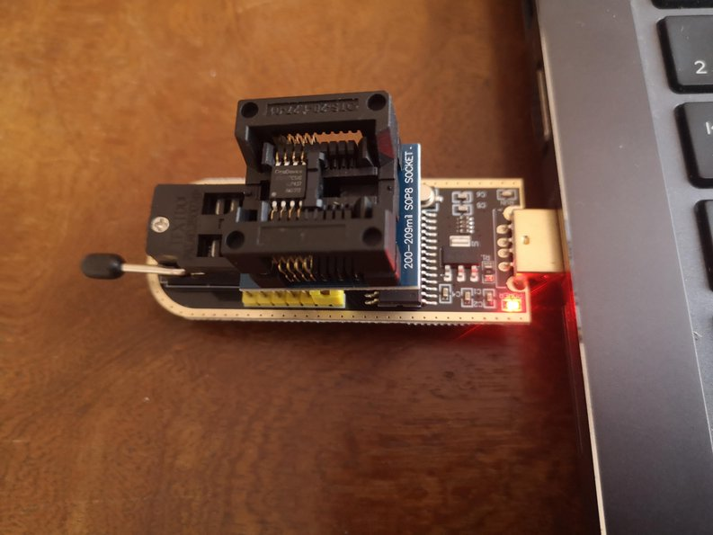

# 🧠 Backup & Restore of Embedded Flash Memory (GD25Q127C)

## Overview

The Lidl Silvercrest gateway includes a GD25Q127C  flash chip (recognized as GD25Q128C by the Linux kernel) storing the bootloader, Linux kernel, root filesystem, and Zigbee configurations.

> ⚠️ **Disclaimer**  
> Flashing or altering your gateway can permanently damage the device if done incorrectly.  
> Always ensure you have verified backups before proceeding.

This guide explains how to **back up and restore** the embedded flash memory using three distinct methods, depending on your level of access to the system:

---

## 🔧 Method 1 – Linux Access via SSH

✅ Use this method if the gateway is bootable and reachable over SSH.

### 🔄 Backup

On the gateway (via `ssh`), run:

```sh
dd if=/dev/mtdx of=/tmp/mtdx.bin bs=1024k
```

Replace `x` with `0`, `1`, `2`, `3` or `4`.

⚠️ You must unmount `mtd4` before dumping it, as it is typically mounted read/write.

On the host, retrieve the file using `ssh` (adjust port and IP as needed):

```sh
ssh -p 2333 -o HostKeyAlgorithms=+ssh-rsa root@<GATEWAY_IP> "cat /tmp/mtdx.bin" > mtdx.bin
```

Once you have collected all partitions, concatenate them into a full image:

```sh
cat mtd0.bin mtd1.bin mtd2.bin mtd3.bin mtd4.bin > fullmtd.bin
```

💡 Refer to the script section at the end of this README to automate this process.

---

### ♻️ Restore

⚠️ This method will only work to restore original partitions coming from the **same** machine. Modified partitions or partiions coming from another machine will have to be restored with Method 2 below.
⚠️ Only restore partitions that are **not mounted**.  
- `mtd0` to `mtd3` are usually safe to write.  
- `mtd4` (overlay) is mounted read/write — unmount it before restoring. This generally means:
```
killall -q serialgateway
umount /dev/mtdblock4
```

To restore, first transfer the file to the gateway:

```sh
ssh -p 2333 -o HostKeyAlgorithms=+ssh-rsa root@<GATEWAY_IP> "cat > /tmp/rootfs-new.bin" < rootfs-new.bin
```

Then flash it:

```sh
ssh -p 2333 -o HostKeyAlgorithms=+ssh-rsa root@<GATEWAY_IP> "dd if=/tmp/rootfs-new.bin of=/dev/mtd2 bs=1024k"
```

💡 Refer to the script section at the end of this README for a simpler approach.


## 🔧 Method 2 – Bootloader Access (UART + TFTP)

🟠 Use this method if Linux no longer boots, but the Realtek bootloader is still accessible via UART.

⚠️ Note: If Linux fails to boot, it may be due to a corrupted partition.  
- In that case, backup via the bootloader might be **unreliable or incomplete**,  
- but restore can be useful **if you have previously created a valid backup using Method 1**.


### 🛠 Setup

This second method will use Realtek bootloader's `FLR` and `FLW` commands to transfer files via TFTP. Therefore, a TFTP client must be available on your host.**

#### Install a tftp client & server on your linux host
```sh
sudo apt install tftp-hpa
```

#### Accessing the Bootloader
- Connect a USB-to-serial adapter to your host, and wire its RX/TX pins to the gateway's UART interface.
- Power on (or reboot) the gateway while pressing the ESC key until the `<RealTek>` prompt appears on the serial console.
- The bootloader's TFTP server listens on **192.168.1.6** by default. Make sure your PC is on the same subnet.

---

### 🔄 Backup (via `FLR`)

This procedure allows you to **extract the content of a specific MTD partition** from flash memory to RAM, and then download it to your host using `tftp`.

The command `FLR` (Flash Load to RAM) instructs the bootloader to:
- Read data from the SPI flash starting at the given offset
- Load it into a specified address in RAM

Then, the bootloader automatically exposes the RAM content via `tftp`, allowing the host to download it.

#### Example: Backup of the `rootfs` (mtd2)

On the bootloader:
```plaintext
RealTek>FLR 80500000 00200000 00200000
```
- `80500000` → RAM address where data will be loaded
- `00200000` → flash offset of mtd2
- `00200000` → size of the partition in bytes (here: 2 MiB)

From the host upload the file:
```sh
tftp -m binary 192.168.1.6 -c get mtd2.bin
```
This command uploads the content from the RAM gateway to your host, storing it as `mtd2.bin`.

💡 You can repeat this process for each MTD partition (see reference table below).
⚠️ tftp is not a secure protocol. Repeat the process 2 or 3 times and make sure md5sum are equals
⚠️ A direct ethernet cable connection is always better :-)

---

### ♻️ Restore (via `FLW`)

The `FLW` (Flash Write from RAM) command allows you to **write binary data stored in RAM** into a specific region of the SPI flash.

This is typically used after a file has been transferred to the gateway via TFTP and loaded into RAM at a known address.

The command format is:
```plaintext
FLW <flash_offset> <ram_address> <length>
```

- `flash_offset`: destination in SPI flash (in hex)
- `ram_address`: where the data is stored in RAM (in hex, e.g. `80500000`)
- `length`: number of bytes to write (in hex)

#### Example: Restore of the `rootfs` (mtd2)

1. On the bootloader:
```plaintext
LOADADDR 80500000
```

2. From the host, download the file to the gateway:
```sh
tftp -m binary 192.168.1.6 -c put mtd2.bin
```

3. Back on the bootloader, write to flash:
```plaintext
FLW 00200000 80500000 00200000 0
```

This writes the file `mtd2.bin` (2 MiB) to SPI flash at offset `0x00200000`.

⚠️ Always double-check offset and size before writing to flash. This process is destructive.

⚠️ All values must be in **hexadecimal**. `AUTOBURN` should be **disabled** (default).

---

### 🧾 Quick Reference: FLR / FLW Commands by Partition

| MTD     | Description        | Offset     | Size       | FLR Command                                       | FLW Command                                       |
|---------|--------------------|------------|------------|--------------------------------------------------|--------------------------------------------------|
| mtd0    | Bootloader + Config| 0x00000000 | 0x00020000 | `FLR 80500000 00000000 00020000`                | `FLW 00000000 80500000 00020000`               |
| mtd1    | Kernel             | 0x00020000 | 0x001E0000 | `FLR 80500000 00020000 001E0000`                | `FLW 00020000 80500000 001E0000`               |
| mtd2    | Rootfs             | 0x00200000 | 0x00200000 | `FLR 80500000 00200000 00200000`                | `FLW 00200000 80500000 00200000`               |
| mtd3    | Tuya Label         | 0x00400000 | 0x00020000 | `FLR 80500000 00400000 00020000`                | `FLW 00400000 80500000 00020000`               |
| mtd4    | JFFS2 Overlay      | 0x00420000 | 0x00BE0000 | `FLR 80500000 00420000 00BE0000`                | `FLW 00420000 80500000 00BE0000`               |

---

## 🔧 Method 3 – SPI Programmer (CH341A or Equivalent)

🔴 Use this method only if the bootloader is corrupted or the gateway is completely unresponsive.

This method involves **physically desoldering the SPI flash chip (GD25Q127C)** from the board and using a USB SPI programmer (such as a CH341A) to read or write its content.

### 🛠 Required Hardware

- A **CH341A** USB SPI programmer (inexpensive and widely available). Use the 25xx entry.
- Make sure the chip is properly seated in the adapter.
- A SOP8 to **200 mil** DIP adapter to insert the chip into the programmer
- **Flux** and either **desoldering braid** or a **small desoldering pump**


   <p align="center">
     
   </p>


⚠️ The use of a programming clip **does not work** on the gateway board and is not recommended.

### ✅ Make sure the chip is recognized by `flashrom`

```sh
jnilo@HP-ZBook:./flashrom -p ch341a_spi -c GD25Q128C
flashrom v1.6.0-devel (git:v1.5.0-44-g4d4688cc) on Linux 6.8.0-57-generic (x86_64)
flashrom is free software, get the source code at https://flashrom.org

Found GigaDevice flash chip "GD25Q128C" (16384 kB, SPI) on ch341a_spi.
No operations were specified.
```
If the package version provided by your linux distro does not detect the chip, check your connection and make sure to install the latest version of [flashrom](https://github.com/flashrom/flashrom). Information about installation can be found on the [flashrom web site](https://www.flashrom.org/).

### ♻️ Restore using `flashrom`

To restore a previously saved image to the flash chip (like **fullmtd.bin** previously created using **Method 1**) use `flashrom` write mode `-w`(flash binary to chip)

```sh
flashrom -p ch341a_spi -c GD25Q128C -w fullmtd.bin
```

The output will look like:

```sh
jnilo@HP-ZBook:./flashrom -p ch341a_spi -c GD25Q128C -w fullmtd.bin 
flashrom v1.6.0-devel (git:v1.5.0-44-g4d4688cc) on Linux 6.8.0-57-generic (x86_64)
flashrom is free software, get the source code at https://flashrom.org

Found GigaDevice flash chip "GD25Q128C" (16384 kB, SPI) on ch341a_spi.
Reading old flash chip contents... done.
Updating flash chip contents... Erase/write done from 0 to ffffff
Verifying flash... VERIFIED.
jnilo@HP-ZBook:
```


⚠️ **Be careful:** This operation will completely overwrite the chip content.   
⚠️ **Be patient:** This operation takes a while.   
⚠️ Ensure that `fullmtd.bin` is exactly **16 MiB (16,777,216 bytes)** and contains valid data.

## 📁 Included Scripts

| Script                        | Method    | Description                                 |
|------------------------------|-----------|---------------------------------------------|
| `backup_mtd_via_ssh.sh`      | Method 1  | Bakup one or all partitions via SSH + dd |
| `restore_mtd_via_ssh.sh`     | Method 1  | Restore one or all partitions via SSH + dd             |


